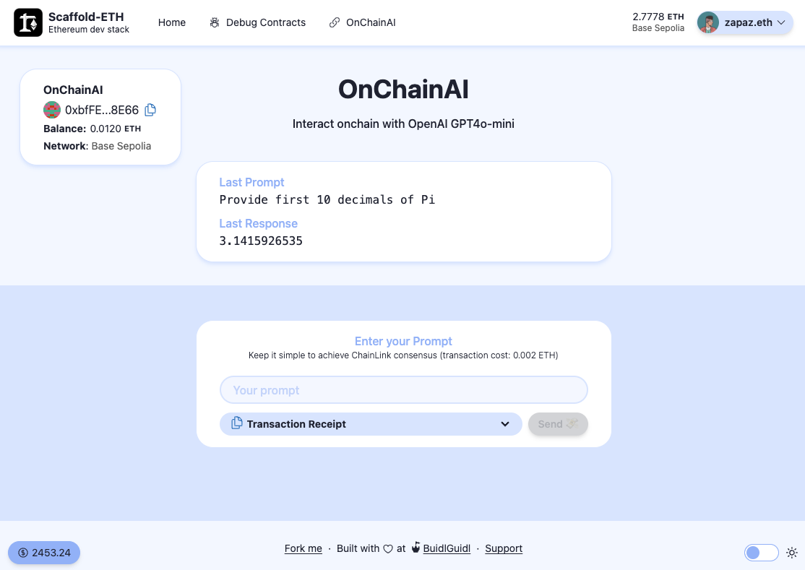

# OnChainAI 🤖

## Onchain `OpenAI` via `Chainlink Functions`
*OnChainAI purpose is to propose a fully decentralized way to interact onchain, between smartcontracts and AI*

## Demo 👀

A running demo of `OnChainAI` using this extension (with also Scaffold-ETH [Fleek extension](https://github.com/zapaz/fleek-extension)) is available on IPFS here:
- [https://many-jelly-incalculable.on-fleek.app/onchain-ai/](https://many-jelly-incalculable.on-fleek.app/onchain-ai/)





## Description 📗

- `OnChainAI extension` is a Scaffold-eth-2 extension, allowing you to develop Dapps using `OpenAI GPT`
- `OnChainAI` protocol is an onchain solution for any smartcontracts to make AI calls.

- `OnChainAI` uses [`OpenAI GPT4o-mini`](https://openai.com/api/) with [`Chainlink Functions`](https://functions.chain.link/).
Each `OpenAI` request launched by `OnChainAI` is sent by multiple `Chainlink` servers that have to reach consensus to return a unique answer. `Chainlink` answer can be retrieved only after a few blocks, and may take more than one minute, depending on the network.

- `OnChainAI` is not free (on mainnet) as `Chainlink` requires some `LINK` tokens and `OpenAI` requires some `$`.
Default model will be a fixed price of `0.0002 eth` per request.
BUT this will be changed in the future to a more dynamic pricing model.

- You can use `OnChainAI` protocol as is, with the contracts already deployed, or you can deploy your own, where you will be able to set your own configuration, and decide on the price of AI requests.

- `OnChainAI extension` is available with a `Hardhat` setup with 3 specific AI tasks to help you start with the `OnChainAI` protocol.

## Install 🛠️

Install via this command:
```sh
$ npx create-eth@latest -e kredeum/onchain-ai-extension
```

Then run the following commands to initialize the new repo,
```sh
$ cd <your new repo>
$ ./init.sh
```

Finally the classic Scaffold-eth-2 commands in 3 different terminals:
```sh
$ yarn chain
```
```sh
$ yarn deploy
```
```sh
$ yarn start
```

In all these commands use `hardhat` option `--network <NETWORK>` to specify the network you want to use.

Note that `OnChainAI` will not work on `hardhat` network (no `Chainlink` there...), so rather use a tesnet like `baseSepolia` or `optimismSepolia` for your tests (avoid `Sepolia` that is slower).

## Usage 💡

You can send your prompt to OnChainAI in different ways:
1. using `debug` page of `Scaffold-eth-2` (`out of the box`)
2. using `OnChainAI UI` included in this extension, via the menu link in `Scaffold-eth-2`
3. using `hardhat ai request` task
4. via your smartcontracts using `OnChainAI` protocol


## Hardhat tasks 🚀

You can run hardhat AI task with `yarn hardhat --network <NETWORK> ai <TASK>`

3 tasks available, 1 for the users: `request`, 2 for the OnChainAI admin : `secrets`, `config`

```txt
AVAILABLE TASKS:

  config 	Display [and update] OnChainAI config
  request	Read last OnChainAI response [and send OnChainAI request]
  secrets	Upload OnChainAI secrets to Chainlink

ai: OnChainAI with Chainlink and OpenAI
```

### `request` task ❓
**Main task**, to be used to send your prompt

Ex: `yarn hardhat --network baseSepolia ai request --prompt "13 time 5 equal ?"`

```txt
Usage: hardhat [GLOBAL OPTIONS] ai request [--prompt <STRING>]

OPTIONS:

  --prompt	OpenAI prompt request for Chainlink

request: Read last OnChainAI response [and send OnChainAI request]
```


### `secrets` task 🔒
Admin task, to be used to upload your secrets to Chainlink

Ex: `yarn hardhat --network baseSepolia ai secrets --expiration 10`

```txt
Usage: hardhat [GLOBAL OPTIONS] ai secrets [--expiration <INT>]

OPTIONS:

  --expiration	Expiration time in minutes of uploaded secrets  (default: 60)

secrets: Upload OnChainAI secrets to Chainlink
```

### `config` task ⚙️
Admin task, to manage OnChainAI configuration

Ex: `yarn hardhat --network baseSepolia ai config --price 0.0002`

```txt
Usage: hardhat [GLOBAL OPTIONS] ai config [--chainname <STRING>] [--donid <INT>] [--explorer <STRING>] [--router <STRING>] [--rpc <STRING>] [--subid <INT>]

OPTIONS:

  --chainname	Chain name
  --donid    	Chainlink DON Id
  --explorer 	Chain explorer url
  --router   	Chainlink routeur address
  --rpc      	Base Rpc url
  --subid    	Chainlink Subscription Id

config: Display [and update] OnChainAI config
```

Any updated value, will be written to the config file, and store onchain for `donid`and `subid`

Router address must be set **before** deployment of a new version of `OnChainAI` contract.

Config file can be found at [packages/hardhat/chainlink/config.json](chainlink/config.json)

### Shortcut ⏩
You can define a shortcut in your package.json like that :
```json
"scripts": {
  "ai": "hardhat --network baseSepolia ai"
}
```
then call it with `yarn ai <TASK> <OPTIONS>`

## OpenAI 🧠

A specific `system prompt` is used for each OpenAI request, you can view it inside the javascript code run by `Chainlink DON` : [packages/hardhat/chainlink/source/onChainAI.js](chainlink/source/onChainAI.js)


## Security 🛡️
In order to never store your secrets and private keys in plain text on your hard disk ("hi @PatrickAlphaC"), this extension use `Chainlink env-enc` module to encrypt your secrets before storing them.

In order to setup `env-enc`, in hardhat directory first define a password with `yarn env-enc set-pw` then input your secrets with `yarn env-enc set`

If you want to keep original unsecure `dotenv` stuff just comment 2 `env-enc` lines, and uncomment the 2 `dotenv` lines at the begining of `hardhat.config.ts`

Same ENV values are needed for both `dotenv` and `env-enc`:
- `DEPLOYER_PRIVATE_KEY` : private key of the deployer
- `ALCHEMY_API_KEY` : alchemy api key
- `ETHERSCAN_API_KEY` : etherscan api key
- `OPENAI_API_KEY` : openai api key

`OPENAI_API_KEY` will be uploaded in a secure way to `Chainlink DON`  (don't use centralized S3 solutions also proposed by `Chainlink`)

## Limitations 🚧

- `Chainlink Functions` is currently in `beta` so as `OnChainAI` is.

- `OpenAi` prompt must be kept simple, as `Chainlink Functions` has a limited memory capacity

- `OpenAI` answer must very short, in order for `Chainlink Functions` to be able to reach a consensus on an answer.
i.e. you can ask '13 time 5 equal ?' but not ask 'Tell me a story'.
And you can add to your prompt some requirements as: answer with  `one word`, `YES or NO` or `true or false`...


## Roadmap  ➡️
- deploy on Mainnet: requires some tuning on requested price, using some `Chainlink Oracle Price feed`
- implement other AI models : `Mistral`, `Claude`, `Lama3` and other `OpenAI` models
- deploy `OnChainAI` on all networks supported by `Chainlink Functions` (curently as of August 2024 : Ethereum, Arbitrum, Base, Optimism, Polygon, Avalanche)
- deploy with same address on all networks
- setup an foundry extension too
- propose a choice between multiple system prompts
